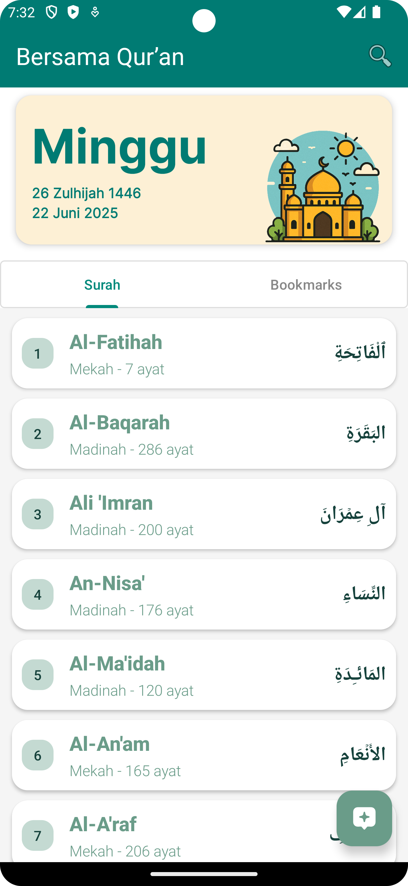
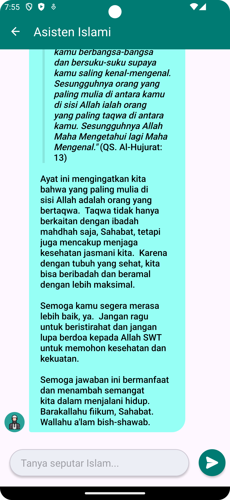

# Aplikasi Al-Qur'an Digital dengan Chatbot Islami

📱 **Deskripsi Singkat:**

Website ini merupakan halaman promosi dan distribusi dari **Aplikasi Mobile Al-Qur’an Digital Berbasis Chatbot Islami**, yang dikembangkan sebagai bagian dari tugas akhir/Skripsi oleh Muhammad Rafif Musyaffa. Aplikasi ini dirancang untuk membantu umat Muslim dalam membaca, memahami, dan bertanya seputar ajaran Islam melalui fitur chatbot.

🔧 **Fitur Utama Aplikasi:**
- 📖 Membaca seluruh 114 surah Al-Qur’an dalam tampilan digital mushaf
- 💬 Chatbot Islami untuk tanya jawab seputar Islam (dengan AI)
- 🔍 Pencarian surah atau ayat dengan cepat
- 🔖 Menandai (bookmark) ayat favorit
- 📱 Tampilan islami yang elegan & ramah pengguna
- 📶 Dapat diakses secara offline

📦 **Tentang Repository Ini:**
- Berisi kode halaman landing page berbasis HTML, CSS, dan JavaScript
- Menyediakan tautan download aplikasi versi `.apk`
- Responsif dan dapat dibuka baik di desktop maupun mobile

📥 **Link Download Aplikasi:**
[Klik di sini untuk mengunduh APK](BersamaQuran.apk)

🧪 **Dikembangkan dalam rangka:**
> Skripsi Sarjana – Program Studi Teknik Informatika  
> “Aplikasi Al-Qur’an Digital Berbasis Mobile dengan Integrasi Chatbot untuk Tanya Jawab Islami”  
> Metodologi: Extreme Programming | Pengujian: Blackbox Testing

🌐 **Preview Website:**  
  

---

🙏 Terima kasih telah menggunakan aplikasi ini. Semoga bermanfaat untuk umat.
